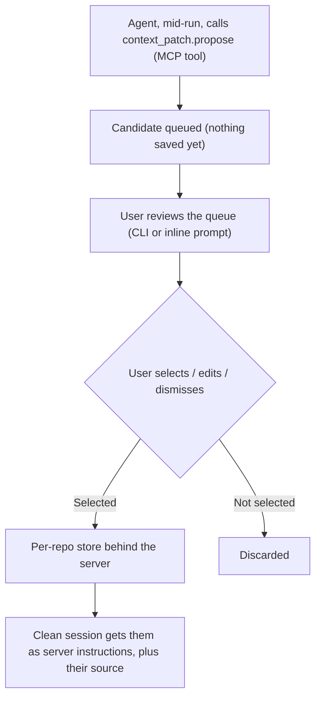

## Goal

**Context Patch is repo-scoped private memory.** Correct the agent once, in one repository, and that correction becomes a small reviewable note that only future sessions *in the same repo* reuse, that you can trace to its source, and that you can delete at any time.

The scope is two-axis: **your patches, for this repo.** Repo-scoped in where they apply (keyed by repo ID, never loaded elsewhere) and user-scoped in who has them (stored under you, never committed, never shared, in production, keyed by user and project behind the permission policy). Teammates on the same repo do not see your patches; sharing is only ever the explicit promote-to-`AGENTS.md` step.

"Done" for the trial: a user corrects the agent, keeps that correction through a review step, and a genuinely clean session in the same repository reuses it and shows which correction it came from, while a different repository receives nothing and deleting it makes it gone. No files in the repo are changed, and the raw conversation is never stored.

The whole feature ships as **one small MCP server plus a thin review surface**. Any harness that speaks MCP gets it: the propose action is an MCP tool, the saved patches ride in as the server's MCP instructions, and review happens outside the model, through whatever thin surface fits: an inline prompt where the client supports elicitation, a minimal CLI if that suits, or Context's own tooling. Nothing below depends on a specific harness; OpenCode is just where the trial runs.

## Background

You correct the agent ("update the schema and regenerate, don't edit generated migrations"). It fixes it. The next clean session has forgotten, so you correct it again. That repetition is the problem.

Harnesses already offer two places to remember things, and Context Patch is not a replacement for either:

- **Project `AGENTS.md`** — committed and shared with the team. The right home for stable policy, but it changes the repo, so it does not fit read-only customer repos, throwaway sandboxes, or private notes.
- **Global `AGENTS.md` / `CLAUDE.md`** — private to you, but applies to *every* repository. It cannot express "remember this, but only here."

Context Patch is the missing middle: **private, and scoped to one repo.** It targets corrections that should live for a single repository without being committed, should survive a throwaway sandbox, and should be tried out and undone rather than baked into the codebase. On top of that scope, it wraps the correction in things a hand-edited file can't give you: it's linked to the message it came from, it isn't saved until you approve it, you can always see where it came from, future sessions load it reliably, and you can delete it in one click. If a patch proves useful over time, a human can choose to move it into the shared `AGENTS.md`, but the feature never does that on its own.

### Why the harness needs nothing custom

The design only uses standard MCP surfaces. Tool support is universal; instruction mounting varies by client, so it is verified where it matters:

- **Tools.** Models call MCP tools mid-run, so `propose` is just an MCP tool.
- **Instructions.** An MCP server declares instructions when the harness connects. How prominently a client mounts them varies; the trial harness verifiably splices them into the system prompt alongside `AGENTS.md`, and any client that mounts server instructions at all can carry the patches.
- **Repo identity.** The server derives it itself from the directory it is launched in (local MCP servers start in the session's workspace): a hash of the git remote, stable across clones, falling back to the repo's root path when there is no remote.
- **Review.** Review needs only a thin surface outside the model, and any of these carries it: an inline MCP elicitation prompt where the client supports one (the trial harness does not yet), a minimal CLI if that fits better, or Context's own tooling. The trial ships the smallest thing that works.
- **Store.** Lives behind the server: a local file for the trial, Context's permission-policy layer in production. The harness and the model never touch it directly.

### Product principles

1. **A correction is just evidence, not permanent guidance, until you review it.**
2. **A saved patch is a suggestion, not a rule the agent must obey.** The host's security rules and the repo's own instructions still win, and anything you tell the agent right now overrides a saved patch.
3. **A saved patch can never grant a permission or trigger an action on its own.**

## Approach

### Flow

**Setup, once.** The user registers the Context Patch MCP server in the harness config, like any MCP server. At session start the harness launches it in the project directory; the server hashes that directory's git remote and that becomes the repo ID everything is keyed to.

**The mistake.** The agent edits a generated migration directly. The user corrects it: "Do not edit generated migrations; update the schema and regenerate." The agent redoes it properly and the fix verifies.

**The agent proposes, mid-run.** Seeing it was corrected and the retry worked, the model calls its one tool, `context_patch.propose`, with a short `command` or `convention` guidance and the user's correction quoted verbatim (the model can always quote it; it has no access to harness message IDs). The server validates the call, appends it to the store file with status *queued*, and returns immediately; the run never waits on a human, and a crash mid-turn cannot lose earlier proposals because each one is already on disk. Nothing is saved, nothing changes for the model; it is a nomination sitting in a file.

Surfacing aggregates at turn end even though writes do not: the tool result reports how many candidates are pending, and the tool description tells the model to mention that count when it wraps up its turn ("queued 2 learnings from this session, review them to keep any"). The queue is the aggregation buffer, and the model, the only party that knows when its turn ends, is the announcer. The optional harness sugar below can automate this; nothing depends on it.

**The user reviews.** Through the review surface (in the trial, a minimal review command; an inline prompt where the client supports elicitation), the queued candidates are listed, each with the correction it came from. The user ticks what to keep, can reword it, and dismisses the rest. Ticked entries flip to *saved* in the file; the rest are dropped. This write goes user → review surface → file; the model is not in this path. A manual add through the same surface queues a candidate directly, for when the agent does not propose one itself.

**The payoff, next clean session.** The harness connects to the server. The server resolves the repo ID again, reads the store file, re-validates every entry from scratch, caps the survivors by count and size, and returns them as its MCP instructions, each labeled as a low-priority hint with the correction it came from. The harness mounts them into the system prompt, and the agent starts the session already knowing the rule. A different repository resolves to a different ID and gets nothing.

**Anytime, control.** `list` shows every saved patch with its source, `delete` removes one, and the store file itself can be hand-edited (see below, validate-on-read keeps that safe). Changes appear at the next connect. A patch that earns its keep can be promoted into `AGENTS.md` by the user; the feature never does that itself.



### Trigger

Two things are separate on purpose: the **model proposes**, the **user disposes**.

- **Proposing happens during the run.** The agent decides in the moment (it has the full context of the correction) and calls `context_patch.propose`. That call is inert, like posting to a feed: it never saves or grants anything.
- **Review is the user's move.** The review surface shows what is queued; no candidates means nothing to review. Where a client supports elicitation, review can surface on its own instead of waiting to be asked.
- **The user makes the final call.** Only what the user selects in review is stored. The agent can suggest, but a suggestion is nothing until a human approves it.
- **The save is not the agent.** The model's only surface is `propose`, which can mark a candidate as queued and nothing more; there is no save tool, and the review answer travels user → review surface → store without touching the model. Even a misbehaving agent can fill the queue but can never mark anything saved.

### Requirements

- **R1.** Candidates come from the agent calling the `context_patch.propose` MCP tool during its run, or from the user adding a rule manually through the review surface. A candidate is only a nomination; it never saves or grants anything on its own.
- **R2.** Each candidate is one `command` or `convention` patch holding the guidance, repo ID, the quoted correction it came from, and (if any) the commit that proved the fix.
- **R3.** Review lists the queued candidates with select, edit, and dismiss; only what the user selects is saved, and nothing is saved before that.
- **R4.** The store keeps each repo's patches separate by repo ID (a hash of the git remote, derived by the server) and lets you delete them.
- **R5.** The server serves saved patches as its MCP instructions, limited to a fixed number and size, each labeled as a low-priority hint with the correction it came from; where the harness's mounting order is known (the trial harness puts MCP instructions after `AGENTS.md`), they land below the repo's own rules, and the labeling carries the same signal everywhere else.
- **R6.** A validator inside the server checks every candidate before it is saved: it enforces the two kinds and length limits, drops low-value ones (version bumps, formatting, small cleanups), and rejects the raw conversation or anything that looks like a password or key.

### Record

```ts
type ContextPatch = {
  id: string
  repositoryID: string          // hash of the git remote (or repo root path), derived by the server
  kind: "command" | "convention"
  guidance: string
  source: {
    correction: string           // the user's correction, quoted verbatim by the agent
    verificationCommit?: string  // the commit that proved the fix worked
  }
  createdAt: number
}
```

### User experience

Review is a short interaction, not a config file. Whatever surface carries it, it needs exactly four verbs:

- **review** — list queued candidates in plain language, each with the correction it came from; the user picks which to keep, can reword one before keeping it, or dismisses all.
- **list** — show every saved patch for the current repo with its source.
- **delete** — remove one; the next clean session no longer receives it.
- **add** — queue a candidate by hand.

The trial carries these in the smallest surface that works: if a CLI, a minimal one; if Context's existing CLI already covers this kind of operation, the verbs fold into it; and if a client supports MCP elicitation, review can appear as an inline card at propose time with the same select / edit / dismiss choices. When a saved patch is applied in a clean session, it again shows which correction it came from.

### How a session loads patches

1. **The harness connects to the MCP server at session start**, like any other MCP server.
2. **The server figures out the repo on its own:** working directory → git remote → repo ID.
3. **It reads that repo's saved patches**, caps them to a fixed count and size (R5), and returns them as its instructions, each labeled with its source.
4. **The harness mounts MCP instructions into the system prompt**; the trial harness verifiably places them after the repo's own `AGENTS.md` rules, and each patch is labeled as a low-priority hint either way.

There is no background sync and no separate load step: patches are served when the harness connects to the server. One caveat: a harness that keeps a single long-lived server connection across sessions picks up newly saved patches on its next reconnect, not instantly; a genuinely fresh session (as in the demo) always connects fresh. A different repo resolves to a different ID and gets nothing, and that lookup *is* the isolation. In production only the server's backend changes (see below); the harness-facing surface is identical.

### The store is a file, and you can edit it

The store is one plain, human-readable file per repository, holding both queued candidates and saved patches (a status flag separates them). Nobody creates it up front: the server creates it lazily on the first propose or manual add, in the server's own data directory named by repo ID, never inside the repository, and a missing file simply means "no patches yet." There is no database process and no sync protocol: the MCP server and the review surface are separate processes that both read and write this same file directly, fresh each time, and neither keeps store state in memory. The file *is* the store.

That makes hand editing a first-class path: open the file, reword or remove a saved patch, done. What keeps that safe is *where* validation runs. Passing the validator at save time is not what earns an entry its place in a prompt; being valid **at load time** is. Every time the server reads the file, at each connect, before serving instructions, it re-runs the same checks the review save ran (allowed kind, length caps, secret-shaped content). Entries that pass are served; entries that fail are skipped and flagged so `list` shows them, and they never reach a prompt. So a hand edit cannot sneak in anything the review path would have rejected.

Timing follows the same rule as everything else: an edit shows up the next time the server loads the file, at the next connect, exactly like a newly saved patch. And the model stays out entirely: `propose` appends to the queue and nothing else, so no tool call can modify or remove a saved entry.

Patches are suggestions, not commands that run. When they disagree, this order wins, top to bottom:

1. Host and sandbox security rules
2. The harness's own and the repo's instructions, including `AGENTS.md`
3. Whatever the user is asking for right now
4. Saved Context Patches

To be precise about how this is enforced: patches are only labeled text in the prompt, so the model is *asked* to rank them last, and nothing mechanically guarantees it. That same fact is what makes principle 3 structural rather than aspirational: words in a prompt cannot grant a permission or trigger an action, so the worst a stale or clashing patch can do is waste a few tokens of bad advice, which review and deletion exist to clean up. A patch that proves useful over time can be moved into `AGENTS.md`, but only as a deliberate, reviewed step.

### Production boundary (out of trial scope)

The trial's local store proves the full loop inside one install: propose, review, save, and reuse in a clean session. In production, throwaway sandboxes lose their local disk, so patches would live outside them in a durable store the sandbox never touches directly, mirroring how production already works there: file edits do not go straight to storage either, they pass through a permission policy.

The surface does not change: the same MCP server and the same four review verbs, with only the storage backend swapped, from a local file to the permission-policy layer, which authenticates the caller and re-checks every record on the server side. Where the verbs live in production depends on what Context already ships: if their existing CLI covers this kind of read/write, the verbs fold into it; if their product has its own review UI, that carries them instead; only if neither fits does a small standalone CLI remain. That fit is a kickoff question, not an assumption. Building the backend is future work, not part of the trial; the propose/review/save contract stays the same.

### Trial implementation slice

- **MCP server (the main surface):** the `context_patch.propose` tool, the validator, and per-repo instructions served at connect. Everything the agent touches goes through this.
- **Store:** the plain per-repo file described above, holding queued candidates and saved patches; the server and the review surface both work against it directly, and it is re-validated on every load.
- **Review surface:** the four verbs (`review`, `add`, `list`, `delete`) against that same store; for the trial, the smallest thing that works — if that is a CLI, a minimal one; if the client supports elicitation, an inline prompt.
- **Optional harness sugar:** a host can auto-surface review at the end of a task (for example, a small plugin listening for the session going idle). Nice to have, not part of the core, and nothing breaks without it.

## Test Strategy

**Demo (two minutes):**

1. Ask the agent to perform a task; it uses the wrong repository command.
2. Correct it and produce a passing result.
3. Open the review surface; the agent's proposed patch is queued; select it to keep (optionally edit it).
4. Start a genuinely clean session in the same repository and repeat the task.
5. Show which correction the patch came from, and the correct behavior.
6. Open another repository and show that the patch is absent.
7. Delete the patch and show that another clean session no longer receives it.

**Acceptance criteria:**

- The two-session demo works without manually copying context.
- The patch never appears in another repository.
- The user can see where every loaded patch came from and delete it.

**Verification:** unit tests for validation and repo isolation, plus one end-to-end two-session test.

### Evaluation: does it actually learn?

The demo proves the loop works once. These measure whether it is worth having:

- **Repeat-mistake rate.** Run the same tasks in clean sessions with patches on vs off. The headline number: how often does a corrected mistake come back?
- **Corrective turns per task.** How many times the user has to correct the agent on an equivalent task, before vs after a patch exists.
- **Suggestion quality.** Of the candidates the agent proposes: how many the user saves as-is (good), saves after editing (partly right), or dismisses (noise). A high dismiss rate means the propose prompt needs tightening.
- **Noise rate.** How often review contains nothing worth keeping from an ordinary session.
- **Cost.** Tokens the injected patches add per session, which the count and size caps (R5) should keep flat.

**Benchmark:** seed a repo with a small set of known conventions (build commands, style rules the agent would not guess). Script the loop: violate, correct, save. Then run fresh sessions against the same tasks and score first-try compliance, patches on vs off. Small (10-20 seeded rules) but repeatable, so the same suite can rerun after any prompt change, and because the whole feature is an MCP server, the identical suite can rerun against a different harness.

## Out of Scope

- No hidden background detector and no silent saving: the agent can nominate candidates via a tool call, but only what the user selects in review is stored.
- No path-level or organization-level sharing.
- No embeddings, semantic retrieval, confidence scores, or conflict engine.
- No production storage backend, and no claim that production persistence works yet.
- No autonomous retry loop, model training, or silent `AGENTS.md` edits.

## Done When

- [ ] The agent can queue a candidate via the `context_patch.propose` MCP tool during a run (and a manual add can too).
- [ ] Review lists queued candidates; only user-selected ones are saved, and nothing is saved before selection.
- [ ] Saved patches are isolated by repo ID and can be deleted.
- [ ] A clean session in the same repo receives the patches as capped, low-priority instructions that show where they came from.
- [ ] A different repository receives nothing.
- [ ] Unit tests (validation, repo isolation) and one end-to-end two-session test pass.
- [ ] The seeded benchmark shows higher first-try compliance with patches on than off.

## Alternatives Considered

- **Harness-native integration** (custom tools and prompt-assembly changes inside one harness): rejected. It ties the feature to that harness for no gain; the MCP server gives the same loop in any client, and production already fronts its storage with policy-mediated surfaces rather than direct access.
- **Reviewed `AGENTS.md` patch:** better for stable shared policy, and the likely next comparison. Rejected as the sole MVP because it requires a repo mutation and does not cover private / read-only / runtime guidance.
- **Full agent teams:** existing harnesses already have substantial task/session primitives; coordination, permissions, and durable jobs would dominate a short trial.

## References

- [Model Context Protocol](https://modelcontextprotocol.io) — tools, server instructions, and elicitation
- [Rules and `AGENTS.md`](https://dev.opencode.ai/docs/rules/)
- [OpenCode MCP servers](https://opencode.ai/docs/mcp-servers) — the trial harness's MCP support
